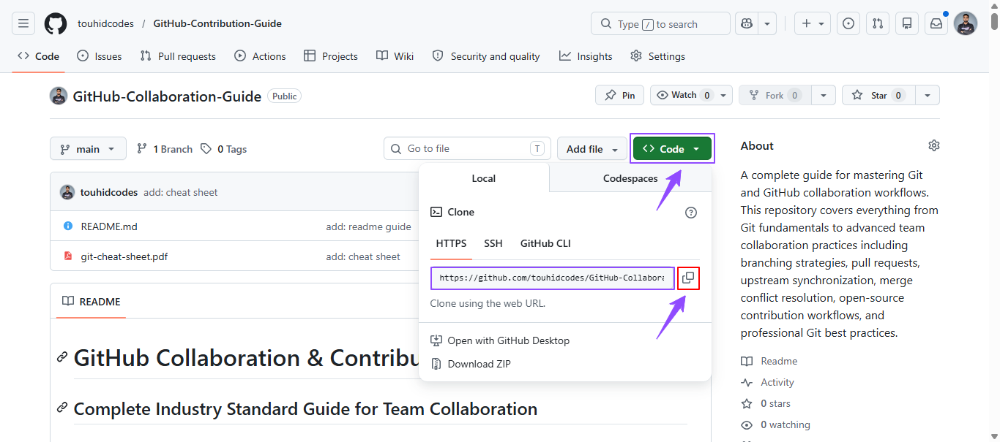
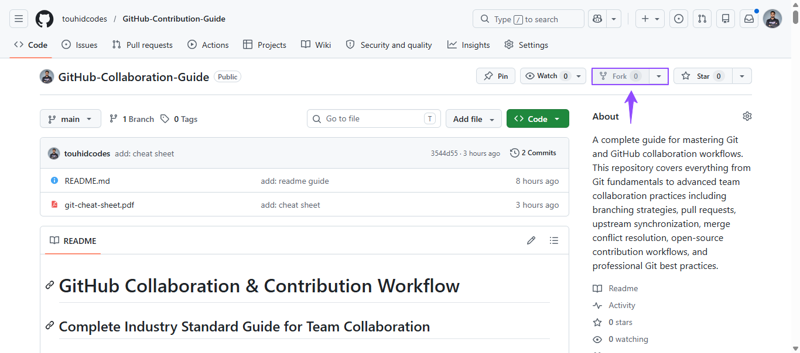
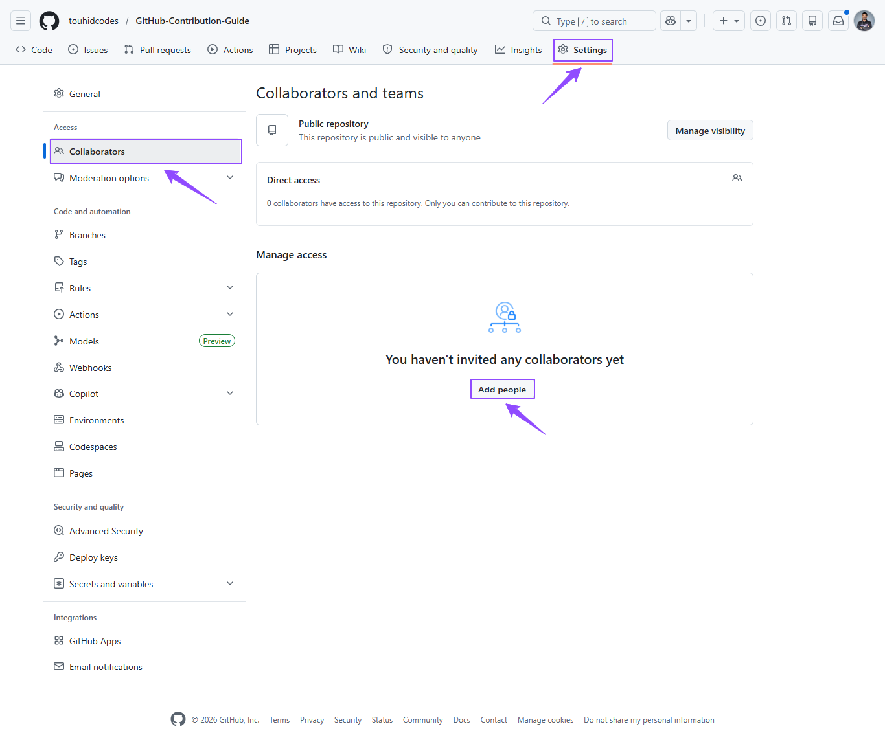
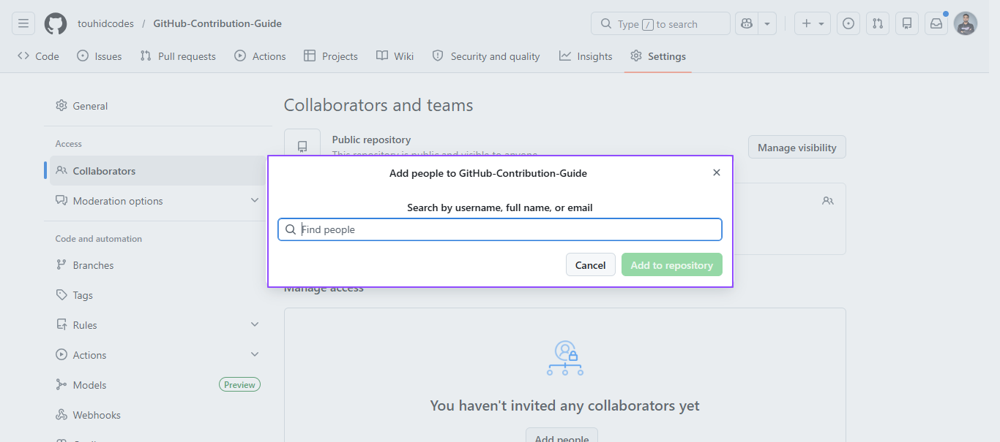
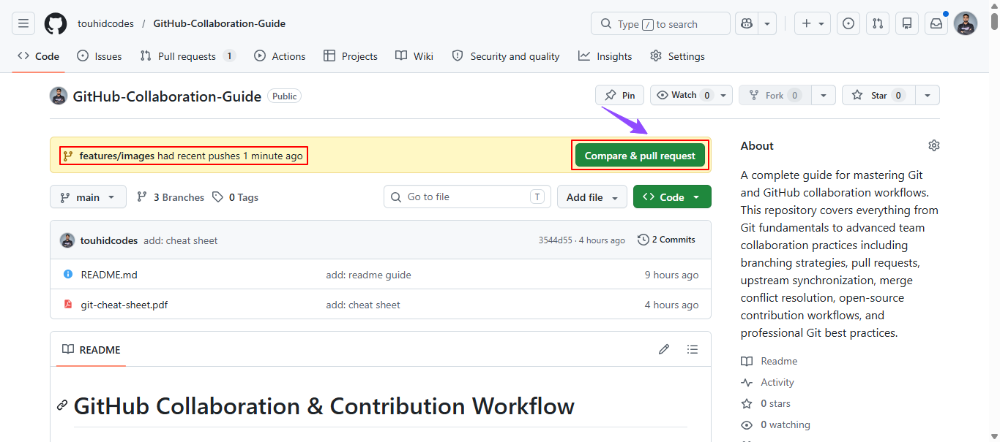
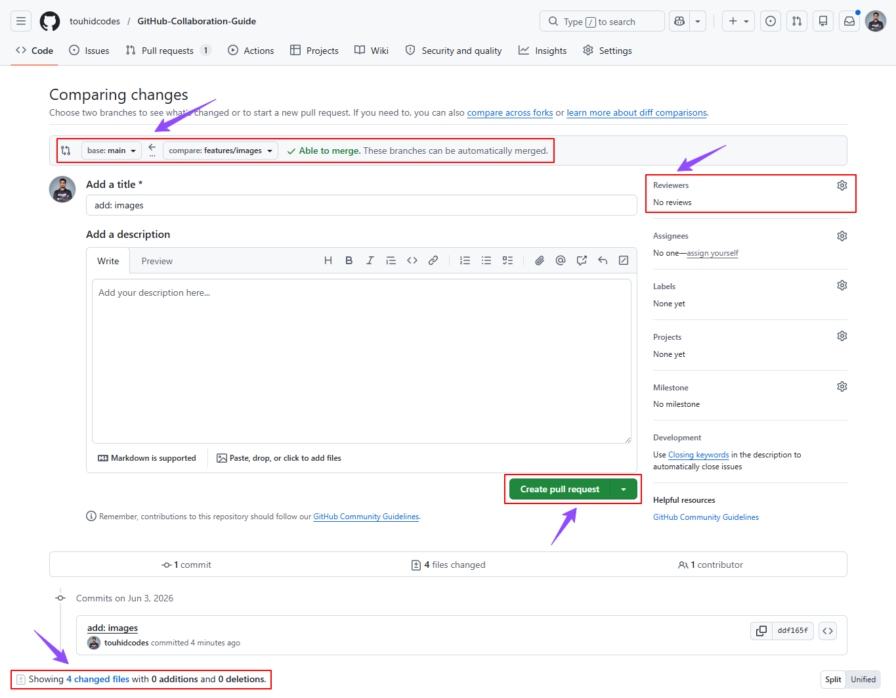
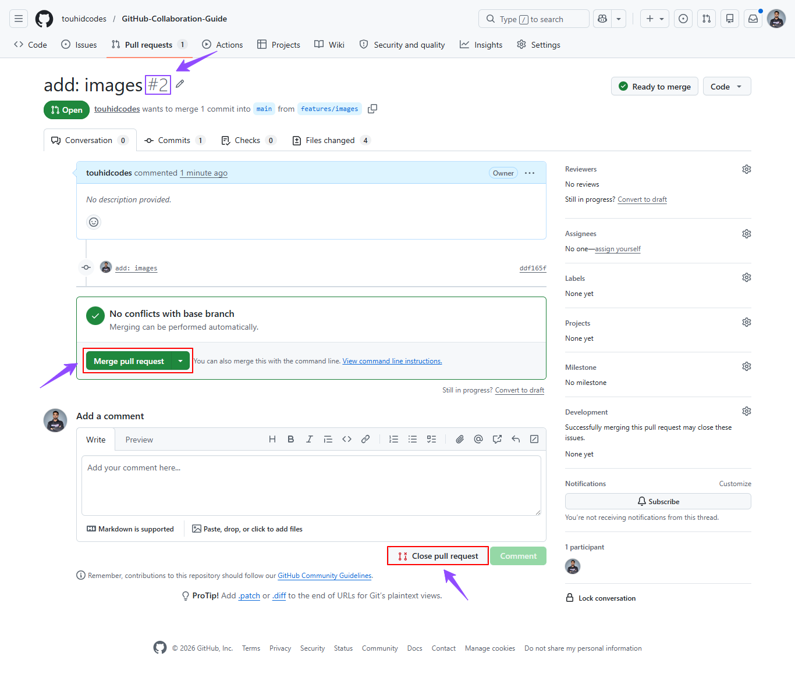
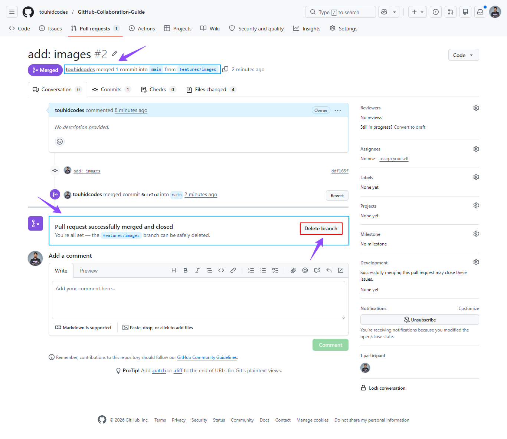

# GitHub Collaboration & Contribution Workflow

---

## Introduction

Modern software engineering is fundamentally collaborative. Whether you are working in a startup, enterprise company, freelance team, or open-source ecosystem, understanding Git and GitHub collaboration workflow is mandatory.

This documentation provides a complete practical guide for:

- Working on team projects
- Managing source code professionally
- Collaborating through Pull Requests
- Contributing to open-source repositories
- Maintaining clean Git history
- Handling conflicts and synchronization
- Following industry-standard branching strategies

---

## Table of Contents

1. [Git Fundamentals](#1-git-fundamentals)
2. [GitHub Collaboration Architecture](#2-github-collaboration-architecture)
3. [Installing & Configuring Git](#3-installing--configuring-git)
4. [SSH Authentication Setup](#4-authentication-setup-using-ssh)
5. [Creating Personal Repositories](#5-creating-personal-repository)
6. [Forking Existing Repositories](#6-forking-existing-repositories)
7. [Adding Collaborators](#7-adding-collaborators)
8. [Branch Workflow](#8-branch-workflow)
9. [Feature Development Workflow](#9-feature-development-workflow)
10. [Professional Commit Standards](#10-professional-commit-standards)
11. [Pull Request Workflow](#11-pull-request-workflow)
12. [Merge Conflict Resolution](#12-merge-conflict-resolution)
13. [PR Approval & Merge Process](#13-pr-approval--merge-process)
14. [Professional Team Workflow](#14-professional-team-workflow)
15. [Real Industry Contribution](#15-real-industry-contribution)
16. [Advanced Git Commands](#16-advanced-git-commands)

---

## 1. Git Fundamentals

### What is Git?

Git is a distributed **`version control`** system developed to track changes in source code during software development.

Git allows developers to:

- Maintain version history
- Collaborate with teams
- Roll back to previous versions
- Track contributions
- Create isolated feature branches
- Merge changes safely

### Why Git is Important

Without Git:

- Collaboration becomes chaotic
- Code overwrites happen frequently
- Tracking bugs becomes difficult
- Deployment pipelines break easily

Git solves these problems by providing:

- Version tracking
- Branching system
- Safe collaboration
- History management
- Recovery mechanisms

---

## 2. GitHub Collaboration Architecture

Git is the version control system GitHub is the cloud platform where repositories are hosted.

### Standard Collaboration Flow

```text
Developer Machine (Computer)
       ↓
Local Repository
       ↓
Remote Repository (GitHub)
       ↓
Pull Request
       ↓
Code Review
       ↓
Merge to Main Branch
```

### Important Terminologies

| Term         | Meaning                          |
| ------------ | -------------------------------- |
| Repository   | Project storage                  |
| Commit       | Snapshot of changes              |
| Branch       | Isolated development line        |
| Remote       | Online repository                |
| Origin       | Your repository                  |
| Upstream     | Original repository              |
| Pull Request | Request to merge changes         |
| Fork         | Personal copy of another repo    |
| Merge        | Combining code                   |
| Rebase       | Rewriting commit history cleanly |

---

## 3. Installing & Configuring Git

### Install Git

Download Git:

https://git-scm.com/downloads

### Verify Installation

```bash
git --version
```

### Configure Git Globally

#### Set Username

```bash
git config --global user.name "Your Name"
```

#### Set Email

```bash
git config --global user.email "your-email@example.com"
```

#### Verify Configuration

```bash
git config --list
```

---

## 4. Authentication Setup Using SSH

### Generate SSH Key

```bash
ssh-keygen -t ed25519 -C "your-email@example.com"
```

### Start SSH Agent

```bash
eval "$(ssh-agent -s)"
```

### Add SSH Key

```bash
ssh-add ~/.ssh/id_ed25519
```

### Copy SSH Public Key

```bash
cat ~/.ssh/id_ed25519.pub
```

### Add SSH Key to GitHub

Go to:

https://github.com/settings/keys

### Test SSH Connection

```bash
ssh -T git@github.com
```

---

## 5. Creating Personal Repository

### Create Repository on GitHub

```text
repo.new → project-name
```

### Navigate Into Project

```bash
cd project
```

### Initialize Project

```bash
npm init -y
```

### Create README

```bash
touch README.md
```

### Stage Changes

```bash
git add .
```

### Commit Changes

```bash
git commit -m "init: Initial project setup"
```

### Push Code

```bash
git push origin main
```

#### OR,

## Cloning Shared Repository

### Clone Repository

#### SSH:

```bash
git clone git@github.com:username/project.git
```

#### HTTPS:

```bash
git clone https://github.com/username/project.git
```



## Navigate into Project

```bash
cd project
```

## Pull Latest Main Branch

```bash
git checkout main
git pull origin main
```

---

## 6. Forking Existing Repositories

### Clone Your Fork

```bash
git clone git@github.com:username/project.git
```



### Add Upstream Remote

```bash
git remote add upstream https://github.com/original-owner/project.git
```

### Verify Remotes

```bash
git remote -v
```

---

## 7. Adding Collaborators

### Why Collaborators Matter

Collaborators allow multiple developers to:

- Push code
- Create branches
- Review Pull Requests
- Collaborate efficiently

### Add Collaborator

Navigate to:

```text
Repository → Settings → Collaborators and teams
```

Click:

```text
Add people
```



#### Search GitHub username or email.

Example:

```text
touhidcodes
```

Click:

```text
Add collaborator
```



### Collaborator Accepts Invitation

After accepting the invitation, collaborators gain repository access.

---

## 8. Branch Workflow

### Never Work Directly on Main

_Always create feature branches._

### Branching Strategy

| Branch      | Purpose                        |
| ----------- | ------------------------------ |
| `main`      | Production-ready stable code   |
| `dev`       | Development integration branch |
| `feature/*` | New feature development        |
| `bugfix/*`  | Bug fixing                     |
| `hotfix/*`  | Emergency production fixes     |

### Create Feature Branch

```bash
git checkout -b feature/login-page
```

#### OR,

```bash
git switch -c feature/login-page
```

### Check Current Branch

```bash
git branch
```

### Always Pull Latest Code First

```bash
git checkout main
git pull origin main
```

### Branch Naming Convention

```bash
feature/login-system
feature/payment-gateway
feature/dashboard-ui
```

### Create Branch

```bash
git checkout -b feature/login-system
```

---

## 9. Feature Development Workflow

### Develop Features

Example tasks:

- Create APIs
- Build UI
- Add validation
- Write tests

### Check Modified Files

```bash
git status
```

### Stage Files

```bash
git add .
```

#### OR,

### Stage Specific File

```bash
git add src/auth/login.ts
```

### Commit Changes

```bash
git commit -m "feat: add login functionality"
```

### Push Feature Branch

```bash
git push -u origin feature/login-systems
```

#### OR,

### Push Existing Branch

```bash
git push
```

---

## 10. Professional Commit Standards

### Bad Commit Messages

```text
updated code
done
final work
```

### Good Commit Examples

```text
feat: implement JWT authentication
fix: resolve navbar responsiveness
docs: update installation guide
ref: optimize payment service
```

---

## 11. Pull Request Workflow

### PR Workflow

```text
Developer
   ↓
Push Feature Branch
   ↓
Create Pull Request
   ↓
Code Review
   ↓
Approve Changes
   ↓
Merge PR
```

### Create Pull Request

After pushing branch, GitHub shows:

```text
Compare & pull request
```

Click it.



### Base Branch

```text
dev
```

### Compare Branch

```text
feature/login-system
```

### After PR creation:

- Team members review code
- Senior developers approve changes
- CI/CD pipelines run tests
- Suggestions are added

### Reviewer Actions

Reviewer may:

- Approve PR
- Request changes
- Add comments
- Suggest optimization

### PR Title Example

```text
feat: implement login authentication system
```

### PR Description Template

```md
# Description

Implemented complete login system.

# Features Added

- JWT Authentication
- Login Form Validation
- Password Encryption
- Error Handling

# Type of Change

- [x] New Feature
- [ ] Bug Fix
- [ ] Breaking Change
- [ ] Documentation Update

# Checklist

- [x] Code tested
- [x] No console errors
- [x] Responsive design checked
- [x] Code formatted
```

## 

---

## 12. Merge Conflict Resolution

When two developers modify same code.

### Step 1: Pull Latest Dev Branch

```bash
git checkout dev
git pull origin dev
```

### Step 2: Move Back to Feature Branch

```bash
git checkout feature/login-system
```

### Step 3: Merge Dev into Feature Branch

```bash
git merge dev
```

### Step 4: Resolve Conflicts

Git will show:

```text
<<<<<<< HEAD
Your Code
=======
Incoming Code
>>>>>>> main
```

Manually fix the conflicts.

### Step 5: Add Resolved Files

```bash
git add .
```

### Step 6: Commit Merge Resolution

```bash
git commit -m "fix: resolve merge conflicts"
```

### Step 7: Push Updated Branch

```bash
git push
```

Then again create a pull request and merge.

### Update PR from Dev to Main Branch

Keeping PR updated is important.

```bash
git checkout main
git pull origin main
git merge dev
git push origin main
```

---

## 13. PR Approval & Merge Process

| Role             | Responsibility          |
| ---------------- | ----------------------- |
| Junior Developer | Creates PR              |
| Senior Developer | Reviews code            |
| Tech Lead        | Final approval          |
| DevOps           | Deployment verification |

### Code Review Actions

| Action          | Meaning               |
| --------------- | --------------------- |
| Comment         | Suggest improvements  |
| Approve         | Accept changes        |
| Request Changes | Require modifications |

### Example Review Comment

```text
Please move token validation into middleware.
```

After approval,

### Available Merge Methods

| Method           | Purpose            |
| ---------------- | ------------------ |
| Merge Commit     | Keeps full history |
| Squash and Merge | Combines commits   |
| Rebase and Merge | Linear history     |

### 

### Industry Recommendation

Most teams prefer:

```text
Squash and Merge
```

After merging cleanup local and remote branches.

### Delete Remote Branch

GitHub provides:

```text
Delete branch
```

### 

### Delete Local Branch

```bash
git branch -d feature/login-system
```

### Sync Local Repository

After merge sync with branches.

```bash
git checkout dev
git pull origin dev
```

---

## 14. Professional Team Workflow

```text
1. Pull latest main/dev branch
2. Create feature branch
3. Develop feature
4. Commit changes
5. Push branch
6. Create Pull Request
7. Code review
8. Fix review comments
9. Merge PR
10. Delete feature branch
```

### Team Rules

#### Always

- Pull latest code before work
- Use feature branches
- Write meaningful commits
- Keep PRs focused
- Review code carefully

#### Never

- Push directly to main
- Commit API keys
- Force push shared branches
- Ignore CI/CD failures

---

## 15. Real Industry Contribution

```text
Fork Repository
      ↓
Clone Fork
      ↓
Add Upstream
      ↓
Create Feature Branch
      ↓
Develop Feature
      ↓
Commit Changes
      ↓
Push Branch
      ↓
Create Pull Request
      ↓
Merge Successfully
```

---

## 16. Advanced Git Commands

### Fetch

```bash
git fetch
```

Downloads changes without merging.

### Pull

```bash
git pull origin main
```

Downloads and merges changes.

### Save Changes

```bash
git stash
```

### Restore Changes

```bash
git stash pop
```

### Fetch Upstream Changes

```bash
git fetch upstream
```

### Merge Upstream Main

```bash
git checkout main
git merge upstream/main
git push origin main
```

### Fetch Changes Only

```bash
git fetch
```

### Rebase Feature Branch

```bash
git checkout feature/authentication-module
git rebase main
```

### Remove Last Commit but Keep Changes

```bash
git reset --soft HEAD~1
```

### Remove Last Commit Completely

```bash
git reset --hard HEAD~1
```

### Restore File

```bash
git restore filename
```

### View Commit History

```bash
git log --oneline --graph --all
```

### Rename Branch

```bash
git branch -m old-name new-name
```

### View Remote Details

```bash
git remote show origin
```

---

## Recommended Resources

- https://git-scm.com/doc
- https://docs.github.com/en
- https://learngitbranching.js.org/
- https://www.conventionalcommits.org/en/v1.0.0/

This documentation represents the industry-standard GitHub collaboration model used across modern software companies and open-source ecosystems.

### Prepared with ❤️ by [touhidcodes](https://github.com/touhidcodes)
